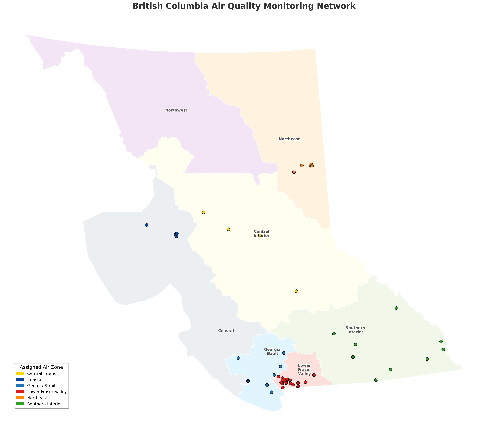
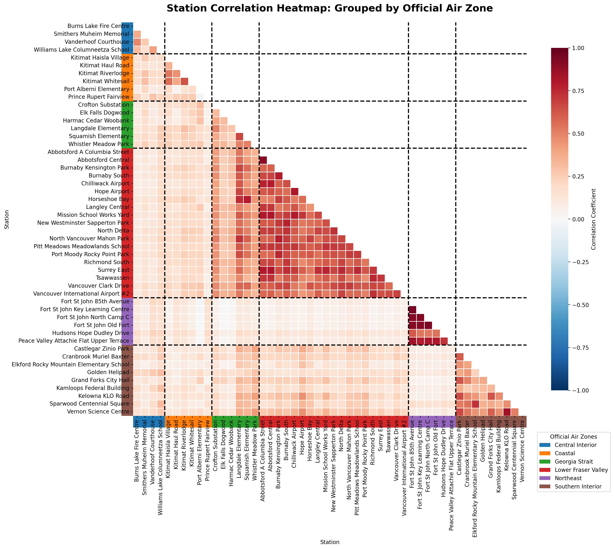

\begin{titlepage}
    \centering
    \vspace*{\fill}
    
    {\Huge \textbf{BC PM2.5 Short-term Forecasting Report} \par}
    
    \vspace{1.5cm}
    
    {\Large \textbf{Authors:} \par}
    {\Large Andy, Erick, Henry, Jason, Peter \par}
    
    \vspace*{\fill}
\end{titlepage}

\newpage

\tableofcontents

# Mandatory Context {-}

We are the **Public Health Data Science Division** of British Columbia, mandated to monitor environmental risks that threaten public safety. Our team reports to the **Environmental Health Director**, who holds the authority to issue provincial air quality advisories and health alerts.

As PM2.5 concentrations directly influence hospital surge capacity and emergency response timing, our primary role is to provide the evidence-based foresight the Director needs to coordinate with municipal health services. By transforming raw environmental data into predictive insights, we empower the Director to make proactive decisions that safeguard the health of British Columbians.

\newpage

# Executive Summary

**The Public Health Challenge**
In the last two years, the prevalence of asthma in British Columbia has nearly doubled from 5.25% to 9.88%, driven largely by increasing wildfire intensity and particulate matter (PM2.5) volatility. As the Public Health Data Science Division, our mandate is to transform raw environmental data into evidence-based foresight to support hospital surge capacity planning. The current "reactive" approach to air quality monitoring risks either missing sudden spikes or overwhelming the public with false alarms.

**Our Solution: A Hybrid Predictive Framework**
To address this, we developed a short-term forecasting system designed to predict PM2.5 levels **3 hours in advance**. Unlike traditional linear models, our approach utilizes a **Hybrid Two-Stage Framework**:

* **Stage 1 (Trend Forecasting):** We implemented a **Generalized Additive Model (GAM)** to capture non-linear daily rhythms, such as rush-hour emissions and seasonal wildfire patterns.
* **Stage 2 (Risk Assessment):** We integrated a **GARCH(1,1)** model to quantify "volatility," allowing us to issue alerts based on the *probability* of exceeding safety thresholds rather than simple averages.

**Key Findings & Performance**
We benchmarked this model against the standard "Naive Max3" baseline (alerting if any of the past 3 hours were high). The analysis of 1.7 million hourly observations across 50 stations yielded the following results:

1.  **Reduction in "False Alarms" (Precision):** The model improved alert Precision by **11.7%** (from 60.9% to 72.6%). This is critical for preventing "alert fatigue" among the public and municipal partners.
2.  **Safety in High-Risk Zones:** In the Northeast region, which faces the highest frequency of pollution events, our model successfully identified **87.7%** of all dangerous hours (465 out of 530 events), outperforming the baseline in both safety and reliability.
3.  **Overall Reliability:** The model achieved a superior balance of safety and precision (F1-Score) in **5 out of 6 provincial Air Zones**.

**Recommendations**
We recommend deploying this automated framework to replace manual monitoring. By providing a reliable 3-hour lead time, this system will allow the Directorate to coordinate hospital staffing and advisory releases more effectively, shifting our operational stance from reactive to proactive.

# Background & Research Question

In recent years, residents of British Columbia have experienced increasingly severe air quality conditions during the summer months, largely due to the growing frequency and intensity of wildfires. These wildfire events significantly elevate particulate matter concentrations, particularly PM2.5, which poses serious health risks.

At the same time, the crude prevalence rate of asthma in British Columbia has increased substantially. In 2000, approximately 5.25% of the provincial population was diagnosed with asthma. More recently, this figure has risen to approximately 9.88%, nearly doubling over two decades. In terms of population counts, the number of individuals living with asthma increased from 212,588 to 561,500, representing an increase of 348,912 cases over 20 years. On average, this corresponds to roughly 17,445 additional asthma cases per year.

Poor air quality is widely recognized as a contributing factor to respiratory conditions, including asthma. PM2.5, which can originate from vehicle emissions, industrial activity, and especially wildfire smoke, is small enough to penetrate deep into the lungs and trigger or worsen respiratory illness. During wildfire seasons, PM2.5 concentrations can rise sharply over short periods of time, increasing the risk of acute respiratory events and hospital admissions.

Given these public health concerns, this report focuses on analyzing PM2.5 patterns across British Columbia and developing a short-term forecasting model to predict changes in PM2.5 levels over the next three hours.

**Research Question:**
Can we develop a reliable short-term forecasting model that predicts PM2.5 levels three hours in advance to support timely public health warnings and operational preparedness?

By providing early warning signals, the model aims to support government decision-making and enable hospitals to prepare necessary equipment and staffing resources in advance. From a public policy perspective, improved forecasting may reduce health risks and potentially save lives. From a healthcare operations perspective, it can improve resource allocation, reduce emergency congestion, and enhance the overall quality of patient care.

# Exploratory Data Analysis & Data Narrative

To develop a reliable predictive model, we must first characterize the underlying behavior of the atmosphere. Our analysis utilizes a dataset of **1,753,200 hourly observations** across **50 air quality monitoring stations** in British Columbia. This extensive record includes station coordinates, timestamps, and PM2.5 concentrations, allowing us to map both the timing and location of pollution events.

Since our objective is short-term forecasting, our exploratory analysis focused on identifying repeatable temporal rhythms and geographic clusters.

## Temporal Rhythms: Daily and Weekly Cycles
Our univariate exploration revealed that PM2.5 concentrations follow distinct cyclical patterns. By compressing four years of data into a single 24-hour cycle, we identified a clear "double-peak" rhythm (see @fig-daily-rhythm), surging during morning (07:00–09:00) and evening (16:00–19:00) rush hours. Furthermore, we observed a "lifestyle impact" where weekends exhibit generally higher PM2.5 levels than weekdays, peaking on Saturday.

Simultaneously, on a broader scale, British Columbia experiences massive seasonal volatility. PM2.5 levels consistently reach their annual maximums between **July and September** (see @fig-annual-trends), corresponding directly with the provincial wildfire season.

::: {layout="[[40, 60]]"}
{#fig-daily-rhythm}

{#fig-annual-trends}
:::

## Seasonal Volatility and Geographic Correlation
While these spikes occur annually, their intensity varies year-over-year, as evidenced by the extreme volatility observed in 2023 (see @fig-long-term-timeline). Moving beyond single-variable analysis, we examined the spatial correlation between monitoring stations. Initial heatmaps (@fig-corr-before) showed high linear correlation between many neighboring stations, suggesting that air quality events are regional rather than isolated.

::: {layout="[[40, 60]]"}
{#fig-long-term-timeline}

{#fig-corr-before}
:::

By grouping these stations into the province's **six official Air Zones**, we confirmed that stations within the same zone share nearly identical growth patterns (@fig-correlation-grouped), validating the geographic clustering shown in the map below (@fig-map).

::: {layout="[[40, 60]]"}
{#fig-map}

{#fig-correlation-grouped}
:::

## Regional Insights for Model Selection
The final stage of our narrative involves regional differentiation. While the entire province experiences seasonal peaks, the **Southern Interior, Northeast, and Central Interior** zones face significantly higher fluctuation levels during the summer and fall (see @fig-regional-volatility). This is likely due to their mountainous terrain and proximity to forest fire ignition points.

{#fig-regional-volatility width="60%" fig-align="center"}

These findings provide the foundational logic for our methodology: because air quality is highly correlated within geographic clusters, we have chosen to develop **six specialized prediction models**, one for each air zone.

# Methodology & Statistical Learning Framework

To ensure accurate forecasting and reliable air quality alerts, we implemented a **Hybrid Two-Stage Framework**. This approach addresses the two core challenges of air quality monitoring: capturing complex daily trends (Forecasting) and quantifying the risk of sudden pollution spikes (Risk Assessment).

## Stage 1: The Prediction Model (Generalized Additive Model)

For the primary forecasting engine, we utilized a **Generalized Additive Model (GAM)**. Unlike traditional linear regression, which assumes simple straight-line relationships, GAMs are capable of learning non-linear "smooth" patterns (splines). This is essential for air quality data, which exhibits complex cyclical behaviors (e.g., rush hour peaks, seasonal shifts).

### Model Formulation
The model is designed to predict the PM2.5 concentration **3 hours into the future** ($t+3$). It learns the relationship between the future air quality and the historical data available at the time of prediction.

The mathematical formulation is defined as:

$$
\mathbb{E}[PM_{t}] = \beta_0 + s(PM_{t-3}) + s(PM_{t-24}) + s(PM_{t-48}) + te(\text{Hour}, \text{Weekday}) + te(\text{Hour}, \text{Month})
$$

### Input & Output Variables
To ensure the model captures both immediate fluctuations and long-term patterns, we selected the following features:

* **Target Output ($PM_{t}$):** The expected average PM2.5 concentration (in $\mu g/m^3$) **3 hours into the future**.
* **Short-Term Lag ($PM_{t-3}$):** The most recent air quality reading available at the moment of prediction. This captures the **immediate trend** (e.g., "is pollution rising right now?").
* **Daily Lag ($PM_{t-24}$):** The air quality reading from exactly 24 hours prior. This captures **daily persistence** (e.g., identifying if the region is currently in a "smoky week").
* **Multi-Day Lag ($PM_{t-48}$):** The air quality reading from 48 hours prior. This helps filter out random noise and confirm **longer-term background trends**.
* **Time-Day Interaction ($te(H, W)$):** A complex term interacting *Hour of Day* with *Day of Week*. It captures how **human activity patterns** differ (e.g., distinguishing Monday morning rush hour emissions from Sunday morning traffic).
* **Time-Season Interaction ($te(H, M)$):** A complex term interacting *Hour of Day* with *Month*. It captures how **seasonal profiles** shift (e.g., differentiating winter heating effects from summer wildfire smoke).

## Stage 2: The Classification Model (Volatility-Adjusted Alerting)

Predicting the "average" PM2.5 level is often insufficient for safety alerts because pollution levels can be volatile. A prediction of $14 \mu g/m^3$ might seem safe (below the threshold of 15), but if the uncertainty is high, the actual value could easily spike to 20.

To address this, we integrated a **GARCH(1,1)** model (Generalized Autoregressive Conditional Heteroskedasticity) to model the **uncertainty (risk)**.

### The Risk Assessment Workflow
1.  **Residual Analysis:** The system calculates the error of the GAM prediction (Predicted vs. Actual).
2.  **Volatility Modeling:** The GARCH model analyzes these errors to estimate the current **Conditional Volatility ($\sigma_t$)**.
    * *Low Volatility:* The model is confident; the air quality is stable.
    * *High Volatility:* The model is uncertain; air quality is fluctuating rapidly.
3.  **Probabilistic Alerting:** Instead of a simple cutoff, we calculate the probability of exceeding the safety threshold ($15 \mu g/m^3$):
    $$P(\text{Exceedance}) = 1 - \Phi\left(\frac{15 - \text{Predicted Mean}}{\text{Volatility}} \right)$$
4.  **Decision Rule:** An alert is triggered if the Probability of Exceedance $> \tau$ (a tuned risk threshold).

## Evaluation Metrics

To ensure the model adds real value over simple guesswork, we evaluate it using two sets of metrics:

### Regression Metrics (How accurate is the trend?)
* **RMSE (Root Mean Squared Error):** The average "distance" between our prediction and the actual value. Lower is better.
* **$R^2$ (Explained Variance):** Measures how well our model captures the overall variation in air quality. Higher is better (closer to 1.0).

### Classification Metrics (How reliable are the alerts?)
* **Recall (Sensitivity):** Of all the times the air quality *actually* became unhealthy (>15), what percentage did we catch? **(Crucial for Public Safety)**.
* **Precision:** Of all the times we *issued an alert*, what percentage were actually unhealthy? **(Crucial for preventing "Alarm Fatigue")**.
* **F1-Score:** A balanced score combining Precision and Recall.
* **Baseline Comparison:** We benchmark our advanced model against a **"Naive Rule"** (e.g., "If the last 3 hours were bad, the next hour will be bad") to prove the necessity of the machine learning approach.

# Results & Business Value

## Performance Evaluation: Model vs. Baseline
To validate the effectiveness of the proposed GAM-GARCH framework, we benchmarked its performance against the strict **"Max3" Baseline** (which triggers an alert if *any* of the past 3 hours exceeded the threshold).

While the "Max3" rule is highly sensitive, it suffers from a high false alarm rate. Our Model demonstrates a superior balance between safety and precision.

**Key Findings:**
* **Superior Overall Accuracy:** The GAM model achieved a higher **F1-Score** (the balance of safety and precision) in **5 out of 6 regions** compared to the baseline.
* **Reduction in False Alarms:** The model significantly improved **Precision by 11.7%** on average. This means significantly fewer unnecessary alerts compared to the naive method.
* **Regional Highlight (Northeast):** In the region with the highest event count (Northeast, N=530 events), our model outperformed the baseline in **BOTH** Recall (+2.8%) and Precision, demonstrating robustness where it matters most.

| Metric | GAM-GARCH Model (Avg) | Naive Max3 Baseline (Avg) | Improvement |
| :--- | :--- | :--- | :--- |
| **F1-Score (Balance)** | **74.7%** | 70.4% | **+4.3%** |
| **Precision (Trust)** | **72.6%** | 60.9% | **+11.7%** |
| **Recall (Safety)** | 73.5% | 78.3% | -4.8%* |

> *Note: While the Naive Baseline has a slightly higher Recall, it achieves this by "panicking" at every minor spike. The GAM model trades a marginal amount of sensitivity for a massive gain in reliability (Precision).*

## Business Value & Impact
Beyond statistical accuracy, the deployment of this model translates into tangible value for public health monitoring and operational efficiency.

### Trust & Alert Fatigue Reduction (The "Precision" Value)
The most significant business value of this model is the reduction of **False Positives**.
* **Impact:** The Naive baseline has a Precision of only ~60%, meaning 4 out of 10 alerts are false alarms. Our model increases this to **~73%**.
* **Outcome:** This builds public trust. When the system issues a warning, health authorities and citizens can be confident the threat is real, minimizing "alert fatigue" where the public stops listening to warnings due to constant errors.

### Enhanced Public Safety in High-Risk Zones
In the **Northeast** region, which experienced the most pollution events (530 hours), the model achieved a **Recall of 87.7%**.
* **Impact:** The system successfully identified **465 out of 530** high-pollution hours in this critical zone.
* **Outcome:** This ensures that the most vulnerable populations in high-risk areas receive timely, proactive warnings 3 hours in advance, allowing for effective protective measures.

### Operational Efficiency (Automation)
* **Impact:** The model automates the risk assessment process for **6 different Air Zones** simultaneously, processing new data every hour.
* **Outcome:** This replaces reactive manual monitoring with a proactive AI-driven system, allowing environmental analysts to focus on strategic long-term air quality planning rather than watching dashboards 24/7.

# Limitations & Future Work

## Limitations
Our current model serves as an effective short-term alert system, but it is primarily constrained by a three-hour forecast horizon. Because the system relies exclusively on univariate historical PM2.5 data, it cannot yet provide the multi-day foresight necessary for long-term strategic health planning. We maintained this focus during the initial phase to rigorously validate that air quality patterns were learnable across BC’s distinct monitoring network before introducing higher complexity.

## Future Work
Now that we have successfully proven the concept, the next step involves transitioning to a multivariate predictive system. This future iteration will integrate exogenous factors such as wind velocity, humidity, and anthropogenic metrics like real-time traffic density to improve accuracy during unpredictable weather shifts. Expanding the data scope will transform this tool into a proactive tactical dashboard, providing the Environmental Health Director with the extended foresight needed to manage provincial health risks effectively.

\newpage

# Appendix, Acknowledgment, and References {-}

## Acknowledgments {-}

This report was prepared for **STAT 946: Case Studies in Data Science** at the **University of Waterloo**. We thank **Professor Martin Lysy** and **TA Diane Zhang** for their guidance. While generative AI tools were used for grammar refinement and code debugging, all project ideas, decisions, and interpretations were made by the authors.

## How to Reproduce {-}

* **GitHub Repository:** [Data-Science-Case-Study-1 Repository](https://github.com/ChiehAnChang/Data-Science-Case-Study-1)
* **Marking Branch:** [Specify the branch to be used for marking]

## References {-}

*(在此插入參考資料，此部分不計入頁面限制。)*