\begin{titlepage}
    \centering
    \vspace*{\fill}
    
    {\Huge \textbf{BC PM2.5 Short-term Forecasting Report} \par}
    
    \vspace{1.5cm}
    
    {\Large \textbf{Authors:} \par}
    {\Large Andy, Erick, Henry, Jason, Peter \par}
    
    \vspace*{\fill}
\end{titlepage}

\newpage

\tableofcontents

# Mandatory Context {-}

We are the **Public Health Data Science Division** of British Columbia, mandated to monitor environmental risks that threaten public safety. Our team reports to the **Environmental Health Director**, who holds the authority to issue provincial air quality advisories and health alerts.

As PM2.5 concentrations directly influence hospital surge capacity and emergency response timing, our primary role is to provide the evidence-based foresight the Director needs to coordinate with municipal health services. By transforming raw environmental data into predictive insights, we empower the Director to make proactive decisions that safeguard the health of British Columbians.

\newpage

# **Executive Summary**

## **The Air Quality Challenge**
Between 2022 and 2025, British Columbia has experienced significant wildfire activity, which leads directly to increased PM2.5 levels. This environmental change correlates with a serious public health trend: over the last 20 years, the rate of asthma among BC residents has nearly doubled, rising from 5.25% to 9.88%. Because air quality is the primary driver of these asthma issues, there is an urgent need to monitor and predict PM2.5 levels effectively to protect the population.

## **Proposed Solution: A Predictive Warning System**
Our solution utilizes a statistical model to predict PM2.5 levels for the next three hours, serving as the foundation for a provincial warning system. This system provides two vital benefits: it helps sensitive residents avoid going outside during high-risk periods and allows hospitals to proactively allocate resources for potential surges in asthma patients or those suffering from other respiratory illnesses. By providing this lead time, the system acts as a shield for both public health and healthcare infrastructure.

## **Performance and Model Reliability**
The model—combining GAM and GARCH techniques—was tested using data from 2022 to 2025 across 50 stations located in six official regions of British Columbia. In performance testing, our model outperformed the baseline by reducing false warnings by 11.7%. While there was a 4.8% decrease in false safety instructions, the overall balance between these two metrics ensures the model is more reliable than current standards. Consequently, our model provides a higher frequency of accurate warnings paired with appropriate safety instructions for the public.

## **Strategic Recommendation**
We recommend the immediate deployment of this automated framework to replace existing manual monitoring processes. By providing a reliable three-hour lead time, this system empowers the Directorate to coordinate hospital staffing and public health advisories with greater efficiency. This transition allows our operations to shift from a reactive stance to a proactive one, ensuring we are prepared before air quality reaches hazardous levels.

# Background & Research Question

In recent years, residents of British Columbia have experienced increasingly severe air quality conditions during the summer months, largely due to the growing frequency and intensity of wildfires. These wildfire events significantly elevate particulate matter concentrations—particularly **PM2.5**—which poses serious risks to public health.

Simultaneously, the crude prevalence rate of asthma in British Columbia has increased substantially. In 2000, approximately **5.25%** of the provincial population was diagnosed with asthma. More recently, this figure has risen to approximately **9.88%**, nearly doubling over two decades [[1]](#ref-1). In terms of population counts, the number of individuals living with asthma increased from 212,588 to 561,500, representing an increase of **348,912 cases** over 20 years. On average, this corresponds to roughly 17,445 additional asthma cases per year.

Poor air quality is widely recognized as a contributing factor to respiratory conditions, including asthma. PM2.5, which can originate from vehicle emissions, industrial activity, and especially wildfire smoke, is small enough to penetrate deep into the lungs and trigger or worsen respiratory illness. During wildfire seasons, PM2.5 concentrations can rise sharply over short periods of time, increasing the risk of acute respiratory events and hospital admissions.

Given these public health concerns, this report focuses on analyzing PM2.5 patterns across British Columbia. Specifically, this analysis evaluates the statistical feasibility of leveraging historical air quality data to develop a predictive framework for short-term PM2.5 fluctuations.

**Research Question:**

*To what extent can a statistically-driven short-term forecasting model provide reliable predictions of PM2.5 levels to support timely public health warnings and operational preparedness?*

By providing early warning signals, the model aims to support government decision-making and enable hospitals to prepare necessary equipment and staffing resources in advance. From a public policy perspective, improved forecasting may reduce health risks and potentially save lives. From a healthcare operations perspective, it can improve resource allocation, reduce emergency congestion, and enhance the overall quality of patient care.

# Exploratory Data Analysis & Data Narrative

To develop a reliable predictive model, we must first characterize the underlying behavior of the atmosphere. Our analysis utilizes a dataset of **1,753,200 hourly observations** across **50 air quality monitoring stations** in British Columbia. This extensive record includes station coordinates, timestamps, and PM2.5 concentrations, allowing us to map both the timing and location of pollution events.

Since our objective is short-term forecasting, our exploratory analysis focused on identifying repeatable temporal rhythms and geographic clusters.

## Temporal Rhythms: Daily and Weekly Cycles

Our univariate exploration revealed that PM2.5 concentrations follow distinct cyclical patterns. By compressing four years of data into a single 24-hour cycle, we identified a clear "double-peak" rhythm (see @fig-daily-rhythm), surging during morning (07:00–09:00) and evening (16:00–19:00) rush hours. Furthermore, we observed a "lifestyle impact" where weekends exhibit generally higher PM2.5 levels than weekdays, peaking on Saturday.

Simultaneously, on a broader scale, British Columbia experiences massive seasonal volatility. PM2.5 levels consistently reach their annual maximums between **July and September** (see @fig-annual-trends), corresponding directly with the provincial wildfire season.

::: {layout="[[40, 60]]" layout-width="50%" fig-align="center"}
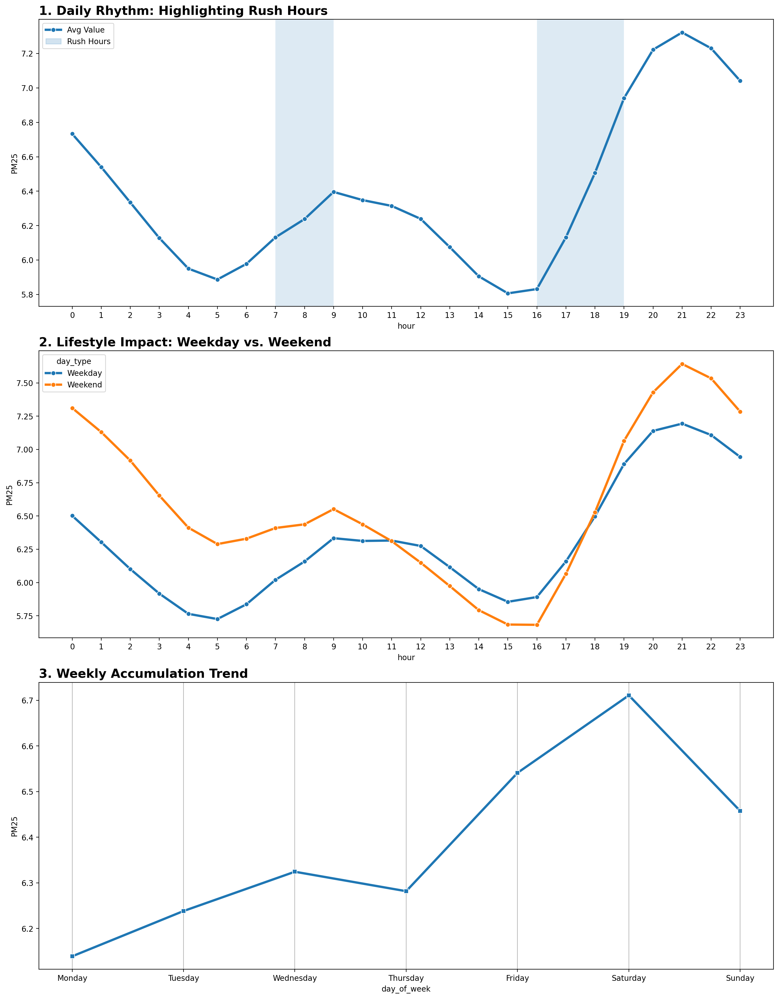{#fig-daily-rhythm}

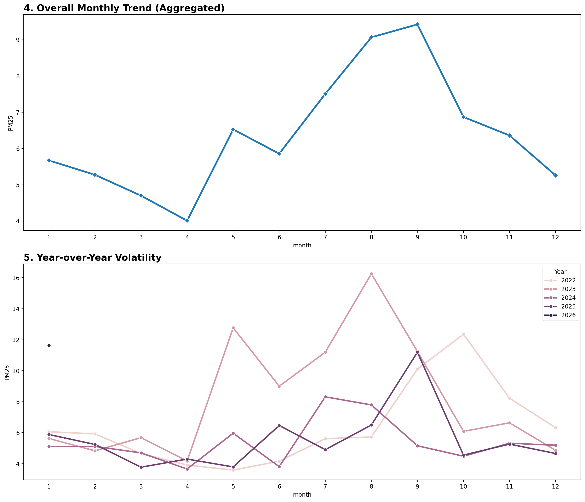{#fig-annual-trends}
:::
## Seasonal Volatility and Geographic Correlation

While these spikes occur annually, their intensity varies year-over-year, as evidenced by the extreme volatility observed in 2023 (see @fig-long-term-timeline). Moving beyond single-variable analysis, we examined the spatial correlation between monitoring stations. Initial heatmaps (@fig-corr-before) showed high linear correlation between many neighboring stations, suggesting that air quality events are regional rather than isolated.

::: {layout="[[40, 60]]" layout-width="50%" fig-align="center"}
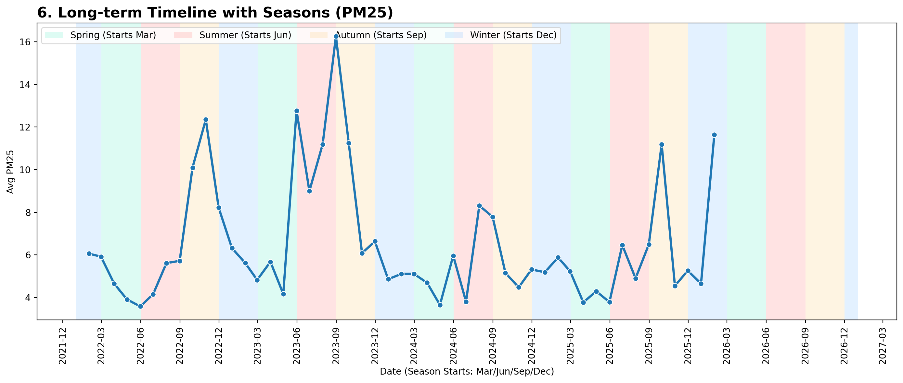{#fig-long-term-timeline}

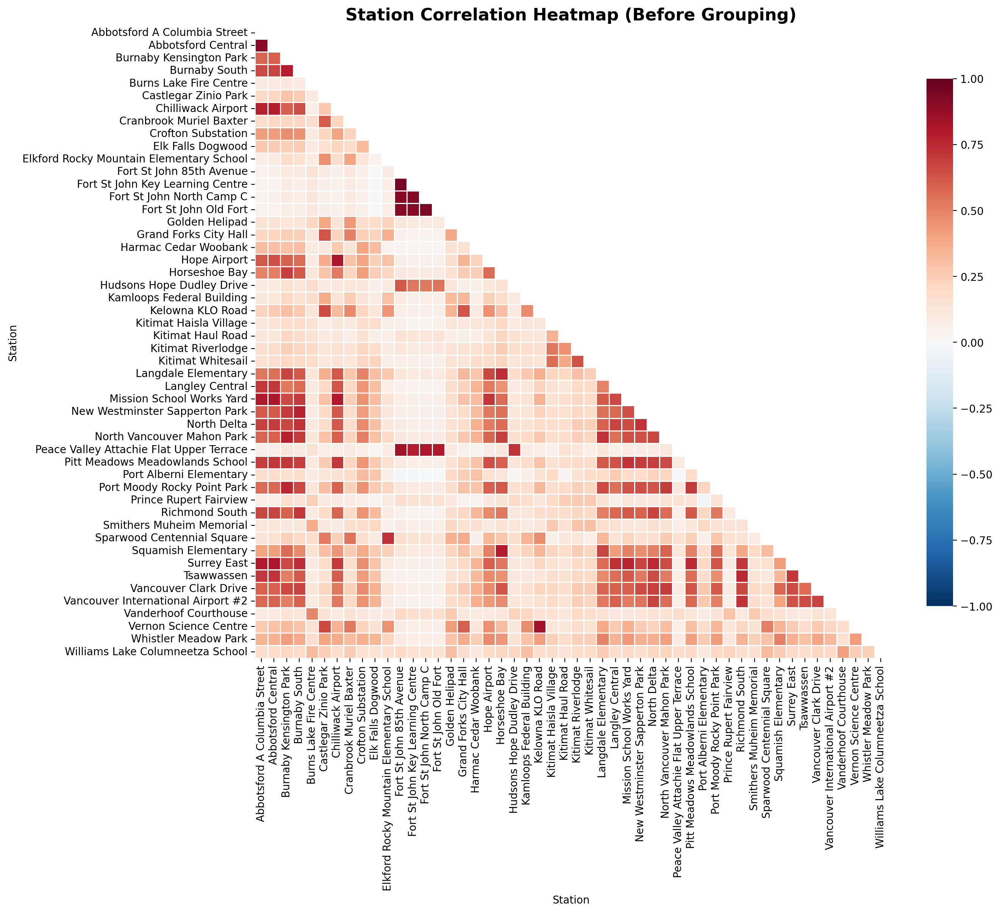{#fig-corr-before}
:::

By grouping these stations into the province's **six official Air Zones**, we confirmed that stations within the same zone share nearly identical growth patterns (@fig-correlation-grouped), validating the geographic clustering shown in the map below (@fig-map).

::: {layout="[[40, 60]]" layout-width="50%" fig-align="center"}
{#fig-map}

{#fig-correlation-grouped}
:::

## Regional Insights for Model Selection

The final stage of our narrative involves regional differentiation. While the entire province experiences seasonal peaks, the **Southern Interior, Northeast, and Central Interior** zones face significantly higher fluctuation levels during the summer and fall (see @fig-regional-volatility). This is likely due to their mountainous terrain and proximity to forest fire ignition points.

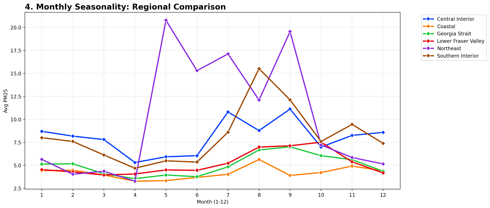{#fig-regional-volatility width="60%" fig-align="center"}

These findings provide the foundational logic for our methodology: because air quality is highly correlated within geographic clusters, we have chosen to develop **six specialized prediction models**, one for each air zone.

# Methodology & Statistical Learning Framework

## Overview

In this section, we present the two primary models implemented in our analysis and the metrics used to evaluate them. The first is a **Regression Model**, designed to predict the specific PM2.5 value for the coming three hours. The second is a **Classifier Model**, which functions as a decision-support tool. It determines whether to issue a safety warning (Safe vs. Unsafe) by building upon the regression output and analyzing the associated risk intervals. The specific definitions of "safe" and "unsafe" are detailed in the model section below. Finally, we introduce the evaluation metrics used to assess the performance of each model separately.

## Our Model

### Regression Model (Forecasting)

Our forecasting system operates on a localized basis, with six distinct regression models corresponding to the six air zones. Based on our Exploratory Data Analysis (EDA) and research, we selected a **Generalized Additive Model (GAM)**. We chose this approach because it excels at capturing non-linear patterns while retaining interpretability—allowing us to understand *why* a prediction was made.

To make a prediction, the model utilizes six key pieces of information: past PM2.5 levels (from 3, 24, and 48 hours ago) to capture short-term history, and time-based indicators (Hour, Weekday, Month) to capture cyclical patterns.

**Key Variables & Definitions:**

* **$E[PM_t]$:** The expected (predicted) PM2.5 value at the future time $t$.
* **$\beta_0$:** The intercept (baseline) term that aligns the prediction to the average PM2.5 level.
* **$s(PM_{t-i})$:** A non-linear function capturing the short-term trend based on PM2.5 levels from **i = 3, 24, 48 hours ago**.
* **$te(Hour, Weekday)$:** An interaction term that captures traffic and lifestyle patterns (e.g., morning rush hour on a Monday vs. a Sunday).
* **$te(Hour, Month)$:** An interaction term that captures seasonal changes (e.g., heating usage in winter evenings vs. summer).

**Model Specification:**

We combine these historical and cyclical insights to form the final prediction using the following formula:
$$
E[PM_t] = \beta_0 + s(PM_{t-3}) + s(PM_{t-24}) + s(PM_{t-48}) + te(Hour, Weekday) + te(Hour, Month)
$$
### Classifier Model (Risk Assessment)

The classifier is built directly on top of the results from the GAM regression. While the regression predicts the *value*, we also need to understand the *uncertainty* (variation) to make a safe decision. To do this, we utilize a **Generalized Autoregressive Conditional Heteroskedasticity (GARCH)** model. The GARCH model analyzes the errors from our regression model to predict the current volatility. This allows us to construct a probabilistic interval around our prediction.

**Key Variables & Definitions:**

* **$\sigma^2_t$:** The estimated variance (volatility) of the PM2.5 level at time $t$.
* **$\omega$:** The baseline variance, representing the long-term average background noise of the data.
* **$\epsilon^2_{t-1}$:** Information regarding the **prediction error** from the previous time step (squared). This captures the impact of recent "shocks" or unexpected spikes.
* **$\sigma^2_{t-1}$:** Information regarding the **variance** from the previous time step. This captures the "persistence" of volatility (i.e., if it was volatile yesterday, it is likely to be volatile today).
* **$\alpha$:** A weighting coefficient that determines how sensitive the model is to recent errors.
* **$\beta$:** A weighting coefficient that determines how strongly past volatility affects current volatility.

**Model Specification:**

We estimate the current uncertainty using the following formula:
$$
\sigma^2_t = \omega + \alpha \epsilon^2_{t-1} + \beta \sigma^2_{t-1}
$$
**Decision Logic (Warning System):**

To determine if a warning is necessary, we calculate the probability that the true PM2.5 value will exceed the safety threshold.

1.  **Safety Threshold:** We use **15** as the critical PM2.5 limit, based on BC government guidelines for sensitive groups (e.g., asthma patients).
2.  **Standardization (Z-Score):** We measure how far the threshold (15) is from our predicted mean ($\hat{PM}_t$), normalized by our predicted volatility ($\sigma_t$).
    $$
    Z = \frac{15 - \hat{PM}_t}{\sigma_t}
    $$
3.  **Risk Probability:** We calculate the probability that the actual value is greater than 15, derived from the standard normal distribution: $P(\text{True Value} > 15)$.
4.  **Final Decision:** Through our empirical research, we determined that a probability greater than **0.35 (35%)** indicates a significant risk.
    * **If Probability > 0.35:** Issue Warning (Unsafe).
    * **If Probability $\le$ 0.35:** No Warning (Safe).

## Baseline Model

To rigorously evaluate our performance, we established a **Baseline Model** for comparison. This simple heuristic predicts the next 3-hour PM2.5 value by simply taking the **maximum PM2.5 value observed in the past 3 hours**. We use this to verify that our advanced models (GAM + GARCH) are actually learning complex patterns rather than just memorizing recent data. We focus heavily on comparing the classification performance against this baseline, as the ability to correctly trigger warnings impacts downstream decision-making more directly than raw numerical accuracy.

## Define Metrics

### Regression Metrics

For the numerical forecasting component, we assess performance using:

1.  **RMSE (Root Mean Squared Error):** This measures the average magnitude of the error (bias) between our predicted value and the true value.
2.  **$R^2$ (Coefficient of Determination):** Ranging from 0 to 1, this metric indicates how well our model captures the *variation* in the data. A score of 1 implies the model perfectly captures the patterns, ensuring it is not just guessing based on the average.

### Classification Metrics

For the decision-support component, accuracy alone can be misleading (e.g., a model could achieve high accuracy by never issuing a warning if "unsafe" days are rare). Therefore, we use metrics that reflect real-world consequences:

* **Recall:** Measures our ability to detect *all* unsafe events (minimizing false safety). This protects public health.
* **Precision:** Measures the trustworthiness of our warnings (minimizing false alarms). This prevents "warning fatigue."
* **F1 Score:** Since we need to balance public protection (Recall) with system credibility (Precision), we rely on the F1 Score, which is the harmonic mean of both metrics, to provide a single, balanced view of performance.

# Results & Business Value

## Performance Evaluation: Model vs. Baseline
Our analysis across six representative regions validates that the proposed system accurately mirrors real-world air quality patterns, providing a reliable foundation for public health decision-making. As shown in the detailed regional summaries in the Appendix, the model effectively captures both short-term 13-day fluctuations and consistent 24-hour daily cycles across diverse geographic profiles. This dual-layered accuracy ensures the system remains robust under varying environmental conditions.

To demonstrate the value added to our current operations, we compared our model against the existing baseline using three management-focused pillars: **Trust (Precision)**, **Safety (Recall)**, and **Operational Balance (F1-Score)**. The table below summarizes the average performance across all six tested locations:

| Metric | GAM-GARCH Model (Avg) | Naive Max3 Baseline (Avg) | Improvement |
| :--- | :--- | :--- | :--- |
| **F1-Score (Balance)** | **74.7%** | 70.4% | **+4.3%** |
| **Precision (Trust)** | **72.6%** | 60.9% | **+11.7%** |
| **Recall (Safety)** | 73.5% | 78.3% | -4.8%* |

The most significant strategic gain is the **11.7% improvement in Precision**. For our organization, this directly translates to higher credibility and a substantial reduction in false alarms that often lead to "alert fatigue" and public distrust. While there is a marginal 4.8% decrease in Recall—meaning some events may not trigger an immediate early alert—the overall improvement in the balanced F1-Score confirms that our model provides a more stable and professional framework for regional air quality management.

## Management Recommendations and Organizational Impact
Based on these results, we recommend a phased transition to this predictive system to mitigate the risks associated with manual monitoring. High-precision warnings ensure that when our office issues an alert, it is backed by statistical certainty, thereby maintaining the trust of both residents and government partners. This balance prevents the misallocation of hospital resources and ensures that emergency departments can prepare for genuine surges in respiratory cases without the disruption of frequent, erroneous notifications.

Implementing this model replaces reactive, labor-intensive dashboard surveillance with a proactive, AI-driven strategy. This shift allows our environmental analysts to pivot from 24/7 monitoring to high-level strategic planning and long-term policy development, significantly increasing the organization’s operational efficiency. We will continue to evaluate the system’s performance iteratively, as detailed in our future work guidelines, to ensure we remain at the forefront of public safety technology.

# Limitations & Future Work

## Limitations

Our current model serves as an effective short-term alert system, but it is primarily constrained by a three-hour forecast horizon. Because the system relies exclusively on univariate historical PM2.5 data, it cannot yet provide the multi-day foresight necessary for long-term strategic health planning. We maintained this focus during the initial phase to rigorously validate that air quality patterns were learnable across BC’s distinct monitoring network before introducing higher complexity.

## Future Work

Now that we have successfully proven the concept, the next step involves transitioning to a multivariate predictive system. This future iteration will integrate exogenous factors such as wind velocity, humidity, and anthropogenic metrics like real-time traffic density to improve accuracy during unpredictable weather shifts. Expanding the data scope will transform this tool into a proactive tactical dashboard, providing the Environmental Health Director with the extended foresight needed to manage provincial health risks effectively.

\newpage

# Appendix, Acknowledgment, and References {-}
## Appendix {-}
**Figure A.1: Southern Interior Performance Summary**
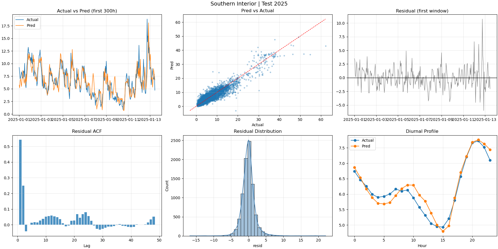
*Captures the 13-day localized pattern (top-left) and the regional diurnal profile (bottom-right).*

**Figure A.2: Central Interior Performance Summary**
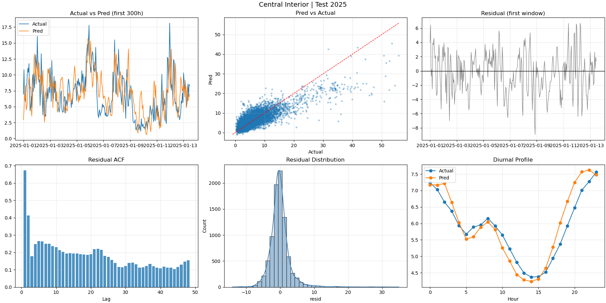

**Figure A.3: Coastal Region Performance Summary**
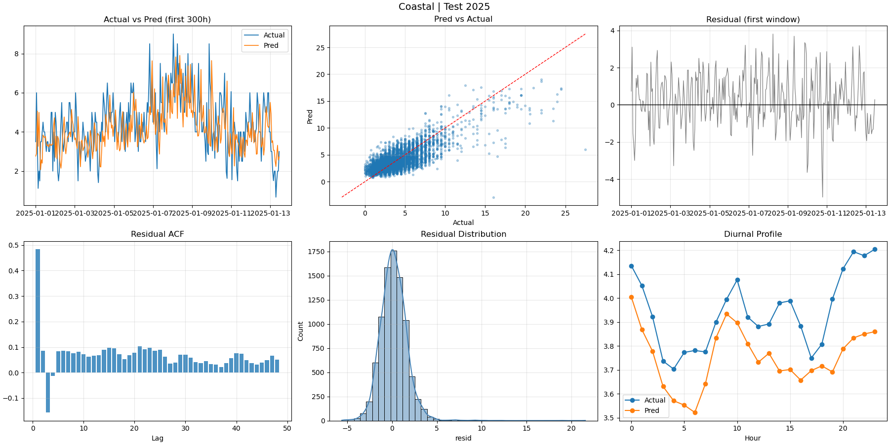

**Figure A.4: Georgia Strait Performance Summary**
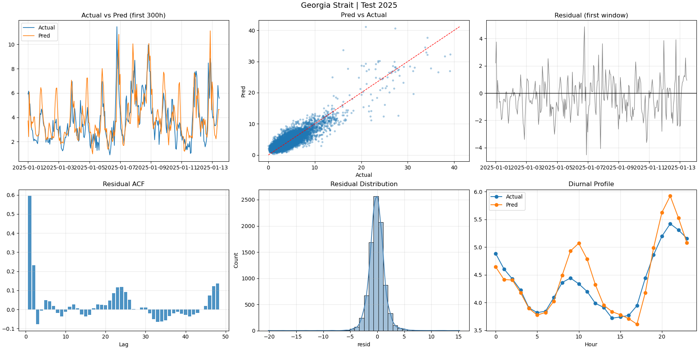

**Figure A.5: Lower Fraser Valley Performance Summary**
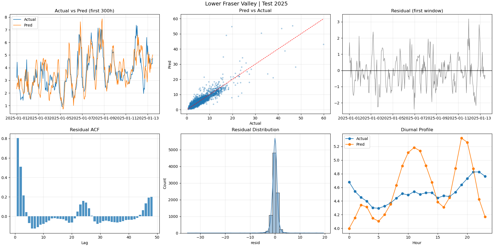

**Figure A.6: Northeast Region Performance Summary**
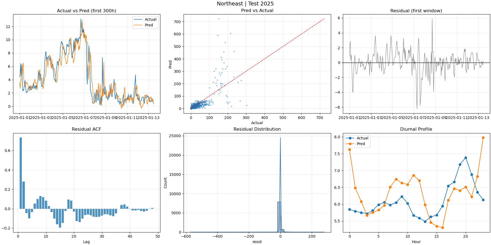

## Acknowledgments {-}

This report was prepared for **STAT 946: Case Studies in Data Science** at the **University of Waterloo**. We thank **Professor Martin Lysy** and **TA Daniel Zhang** for their guidance. While generative AI tools were used for grammar refinement and code debugging, all project ideas, decisions, and interpretations were made by the authors.

## How to Reproduce {-}

* **GitHub Repository:** [Data-Science-Case-Study-1 Repository](https://github.com/ChiehAnChang/Data-Science-Case-Study-1)
* **Marking Branch:** [Specify the branch to be used for marking]

## References {-}

\begin{enumerate}
    \item \label{ref-1} Public Health Agency of Canada. (2024). \textit{Canadian Chronic Disease Surveillance System (CCDSS) Data Tool 2000–2022}. Government of Canada. \url{https://health-infobase.canada.ca/ccdss/data-tool/}
\end{enumerate}