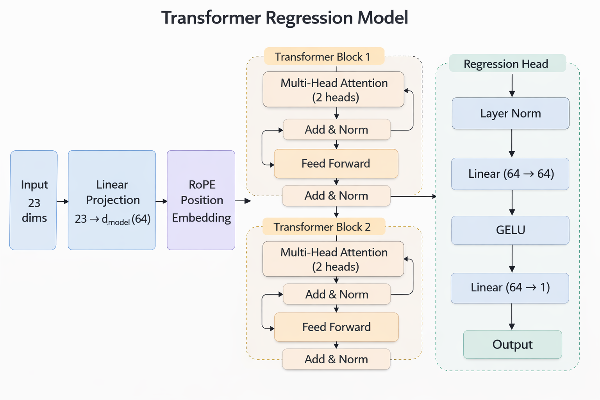
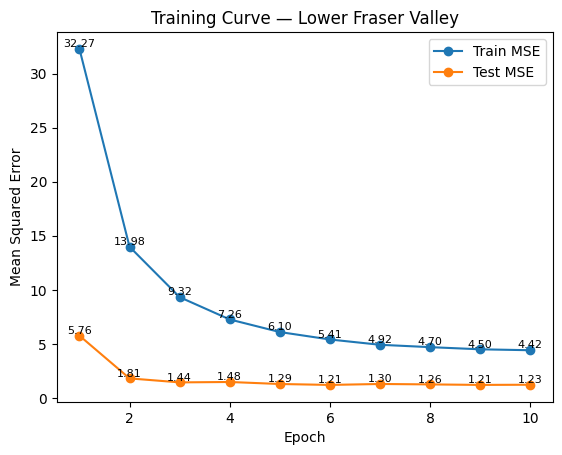
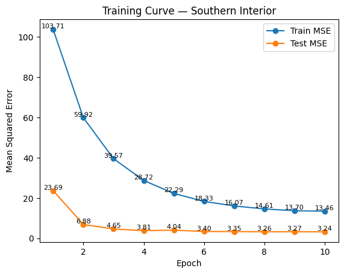
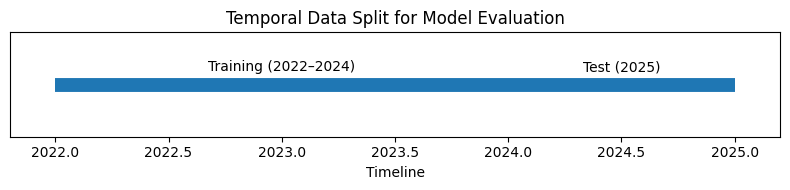

## Model Architecture and Design Choice

### Transformer Model Structure

::::: columns
::: {.column width="50%"}
**Architecture**

-   Transformer encoder
-   Sequence input: **96 hours**
-   d_model = 64
-   2 attention heads
-   2 Transformer layers
-   dropout = 0.1

Total parameters size: 0.106M

Total parameters intentionally **kept small** to reduce overfitting.
:::

::: {.column width="50%"}
{width="100%"}
:::
:::::

------------------------------------------------------------------------

### Why Not More Complex Alternatives?

We experimented with **more complex architectures** inspired by LLaMA:

-   SwiGLU feed-forward layers
-   Larger hidden dimensions
-   Deeper Transformer blocks

However:

-   Dataset size relatively small: 26245 data entries(12.05 MB) per Zone
-   Models trained **separately per zone**
-   Complex variants did **not improve stability or performance**

Final decision:

**Use a simpler Transformer block with strong regularization.**

------------------------------------------------------------------------

## Optimization and Model Tuning

### Training Setup

Optimizer: **AdamW**

Loss: **MSELoss**

Training parameters:

-   Batch size: 256
-   Epochs: 10
-   Learning rate: 5e-4 → 5e-6 (cosine decay)
-   Weight decay: 0.05

Hyperparameter search was performed using **manual exploration**.

------------------------------------------------------------------------

### Feature and Window Experiments

Feature set includes:

-   PM2.5 lags and rolling statistics
-   Fire activity indicators (FRP, fire counts)
-   Temporal encoding (hour, weekday, month)

Window length experiment:

12h, 24h, 48h, 72h, **96h**, 168h

Best performance observed at **96 hours**.

------------------------------------------------------------------------

### Training Dynamics

::: {layout-ncol="2"}
{width="45%"}

{width="45%"}
:::

Training monitored using **train and test loss curves** across 10 epochs.

------------------------------------------------------------------------

### Final Model Performance

| Zone                | RMSE  | MAE   | R²    | N_test |
|---------------------|-------|-------|-------|--------|
| Lower Fraser Valley | 1.108 | 0.659 | 0.843 | 8710   |
| Southern Interior   | 1.801 | 1.230 | 0.863 | 8710   |

------------------------------------------------------------------------

## Validation Strategy and Leakage Prevention

### Time-Series Evaluation

Random data splits are **inappropriate for time-series data**, because they allow future observations to influence training.

Instead we use **temporal splitting**.

Train: **2022–2024**\
Test: **2025**

------------------------------------------------------------------------

### Leakage Prevention

Several safeguards were applied:

-   StandardScaler **fit only on training data**
-   Test data transformed using training statistics
-   Sequence windows constructed **after dataset split**
-   No window crosses train–test boundaries

------------------------------------------------------------------------

### Zone-Specific Modeling

Models trained **independently** for each region:

-   Lower Fraser Valley
-   Southern Interior

This avoids mixing **regional wildfire patterns**.

Model predictions follow **PM2.5 trends in the unseen test year**, demonstrating generalization to new wildfire seasons.

------------------------------------------------------------------------

## 10. Main performance comparison

| Zone                | model       | Precision@25 | Recall@25 | F1@25 | F2@25 |
|---------------------|-------------|--------------|-----------|-------|-------|
| Lower Fraser Valley | baseline    |        0.500 |     0.538 | 0.518 |       |
|                     | Transformer | 0.538        | 0.538     | 0.538 | 0.538 |
| Southern Interior   | baseline    |        0.945 |     0.896 | 0.920 |       |
|                     | Transformer | 0.945        | 0.888     | 0.916 | 0.899 |

- Model performance differed sharply by air zone.

- Southern Interior performed strongly: Precision 0.945, Recall 0.888, F1 0.916, F2 0.899.

- Lower Fraser Valley performed much worse: all key metrics were 0.538.

- Overall, the model appears reliable in the Southern Interior but much less dependable in the Lower Fraser Valley.

------------------------------------------------------------------------

## 11. Diagnostics and air-zone comparison

- Diagnostics show that performance is highly region-dependent.

- The Southern Interior appears to have clearer or more stable event patterns, which the model captured well.

- The Lower Fraser Valley appears to be a more difficult forecasting environment, leading to weaker warning performance.

- This comparison shows why zone-level evaluation matters: overall results alone would hide important regional differences.

------------------------------------------------------------------------

## 12. Limitations, uncertainty, and final takeaways

- Results should be interpreted with caution because performance is not consistent across air zones.

- The weaker Lower Fraser Valley results indicate greater uncertainty and a higher risk of unreliable warnings.

- The approach shows clear promise, especially for the Southern Interior.

- Main takeaway: the model has value, but further refinement and zone-specific tuning are needed before broader operational use.